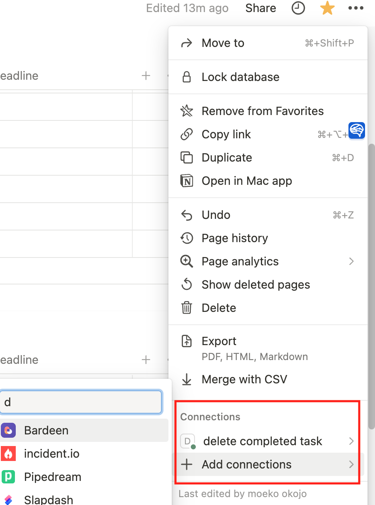

# notion-api-command

Notion apiを叩くための自分専用スクリプト

## Description

## Demo

## Requirement

- jq

### instruction

[ここ](https://www.notion.so/ja-jp/help/create-integrations-with-the-notion-api)を参考にNotion APIを叩くためのsecretを作成

NotionのデータベースIDを取得する

`https://www.notion.so/<abcdefghijklmnopqrstuv>?v=xxxxxxxxxxxxxxxxxxx`

Notionのプロパティから接続するintegrationを選択



## Usage

```shell
notion-api-command.sh is a tool for Notion API

Usage:
    notion-api-command.sh [command] [<options>]
    [command]
      configure:        Store DATABASE_ID and NOTION_API
      get_completed:    Get block id which property is tagged with "Completed"
      delete_completed: Delete block which property is tagged with "Completed"

Options:
    --version, -v     print notion-api-command.sh version
    --help, -h        print this
    --database_id     notion database id
    --token           notion integration token
```

下記使い方

```shell
➜ ./notion-api-command.sh configure
Enter your DATABASE_ID: xxxxxxxxxxxxxxx
Enter your NOTION_API_KEY: yyyyyyyyyyyyyy
➜ ./notion-api-command.sh get_completed
  % Total    % Received % Xferd  Average Speed   Time    Time     Time  Current
                                 Dload  Upload   Total   Spent    Left  Speed
100  1952    0  1807  100   145   2708    217 --:--:-- --:--:-- --:--:--  2948
asfasdfasdf-asfd-hoge-fasf-xxxxxxxxxxxxxx
```

## Install

## Contribution

## Licence

## Author

[okojomoeko](https://github.com/okojomoeko)
